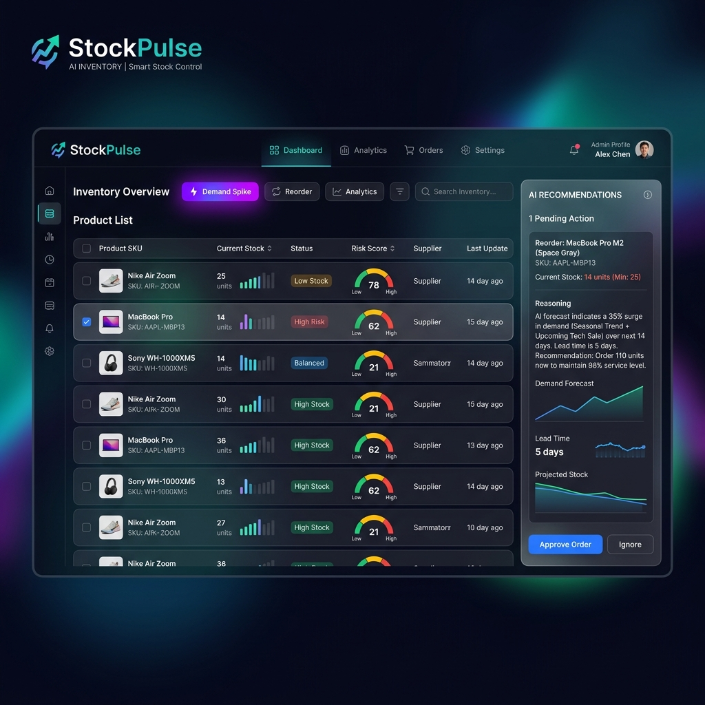

<div align="center">
  
# 📈 StockPulse

**AI-Powered Inventory & Dynamic Pricing Advisor**


<br/>



</div>

> 🏆 Built for the Zycus Hackathon — [Your Name] — [Date]

Nobody notices when stock drops too low or when a product suddenly goes viral until it's too late, resulting in lost sales or stockouts. StockPulse is a reactive commerce advisor that solves this by monitoring your storefront's inventory and demand velocity in real time. When it detects low stock or a demand spike, it automatically triggers a background AI advisor to calculate reorder quantities and price adjustments. It then queues these suggestions for human approval—meaning nothing is ever changed automatically without your consent.

---

## 📑 Table of Contents

- [How it works](#how-it-works)
- [Why this matters for procurement](#why-this-matters-for-procurement)
- [What's inside](#whats-inside)
- [Tech Stack](#tech-stack)
- [Quick start](#quick-start)
- [Try it yourself — demo script](#try-it-yourself--demo-script)
- [Design decisions, briefly](#design-decisions-briefly)
- [What this doesn't do (yet)](#what-this-doesnt-do-yet)

---

## ⚙️ How it works

**Sale Simulated → Threshold Check → AI Advisor → Suggestion Queued → Human Approval → Change Applied**

1. Someone simulates a sale (or stock naturally drops)
2. System checks: is stock below threshold? is demand spiking?
3. If yes → background AI advisor is called automatically
4. AI suggests a price change + a reorder quantity, with its reasoning
5. You SEE this happen live in the Agent Activity Feed
6. You accept or reject — only then does anything actually change

---

## 🏢 Why this matters for procurement

While StockPulse is built for a retail storefront, the underlying architecture directly models the challenges of enterprise Source-to-Pay platforms. Modern procurement requires agentic automation (like requisition-to-PO conversions) that is highly reliable, explainable, and supervised by humans. 

- **The Human-in-the-Loop Pattern**: The reorder-suggestion flow already follows the exact shape of agentic procurement automation — detect a need → an agent recommends an action → it's queued, not auto-executed → a human approves before anything is committed — just applied to inventory replenishment instead of purchase requisitions.
- **Fail-Safe Reliability**: The rule-based fallback (self-healing when AI is unavailable) reflects the same reliability bar procurement approval workflows need: automation must degrade safely, never silently fail or act ungoverned.
- **Compliance & Trust**: The runtime-swappable strategy pattern (AI ↔ deterministic rules) mirrors how procurement platforms often need both AI-assisted and rules-only modes side by side for compliance or trust reasons.

This isn't a full procurement platform — it's a smaller-scale demonstration of the same "observe → reason → act → human checkpoint" pattern, applied to a retail inventory problem because that's what the brief specified.

---

## 📁 What's inside

| File/Folder | What it does |
|-------------|--------------|
| `agentic_loop.py` | The background brain of the app that listens for inventory events and decides whether to ask for a new strategy. |
| `event_bus.py` | A simple publish-subscribe system that pushes real-time agent updates to the frontend via Server-Sent Events (SSE). |
| `llm_gateway.py` | The pluggable interface to AI providers (Gemini, Groq, Ollama) that formats our data into prompts and parses the JSON response. |
| `strategies/` | Contains both the AI strategy (which calls the LLM) and the rule-based strategy. You can instantly toggle between them without restarting the server. |
| `services/` | The business logic layer containing the risk scoring engine, analytics aggregations, dynamic reorder calculations, and the what-if simulator. |
| `routers/` | FastAPI endpoints connecting the frontend to our services. |

> **Self-Healing Fallback**: If the AI call fails or your API key is missing, the system silently uses the rule-based logic instead — nothing breaks.

---

## 🛠 Tech stack

| Layer | Technology |
|-------|------------|
| **Backend** | FastAPI + SQLAlchemy + SQLite |
| **Frontend** | React 18 + Vite |
| **AI Gateway** | Gemini / Groq / Ollama via pluggable gateway |

---

## 🚀 Quick start

You can get the system running locally in under 5 minutes.

### 1️⃣ Backend setup

```bash
cd backend
python -m venv venv

# Activate venv (Windows)
venv\Scripts\activate
# Activate venv (macOS/Linux)
# source venv/bin/activate

pip install -r requirements.txt

# Add your LLM API key to .env.
# (Leaving it blank still works, triggering the rule-based fallback!)
copy .env.example .env

# Start the server on port 8000
uvicorn app.main:app --reload
```
API docs available at: **http://localhost:8000/docs**

### 2️⃣ Frontend setup

```bash
cd frontend
npm install

# Start the dev server on port 5173
npm run dev
```
Open **http://localhost:5173** in your browser.

---

## 🎮 Try it yourself — demo script

To see the "aha" moment, follow these steps with the seeded products:

1. **Trigger an Inventory Low**: Find the **Organic Cotton T-Shirt**. Its stock is artificially seeded close to the reorder threshold. Click "🛒 Sell" a few times. Once stock drops below the threshold, watch the Agent Activity Feed light up and wait for a reorder suggestion to appear on the right!
2. **Trigger a Demand Spike**: Find the **Hoodie — Heather Grey**. Click the "⚡" (Demand Spike) button to instantly triple its velocity (or click Sell rapidly). The agent will notice the surging demand and suggest a dynamic price increase alongside an aggressive reorder.

---

## 🏗 Design decisions, briefly

| Decision | Why |
|----------|-----|
| **Why SQLite over Postgres** | Keeps the setup zero-friction; you don't need Docker to run this demo. |
| **Why suggestions need human approval** | LLMs can hallucinate. The human-in-the-loop ensures no destructive actions happen automatically. |
| **Why rule-based is the safety net** | AI endpoints can fail or time out. A deterministic fallback ensures the store keeps running. |

See [ADR.md](ADR.md) for the full reasoning and architectural context.

---

## 🚧 What this doesn't do (yet)

- No cart or checkout flow (focuses purely on the admin/inventory side)
- No real payment processing (simulated sales only)
- No competitor price scraping (pricing is adjusted based purely on internal inventory/velocity metrics)
